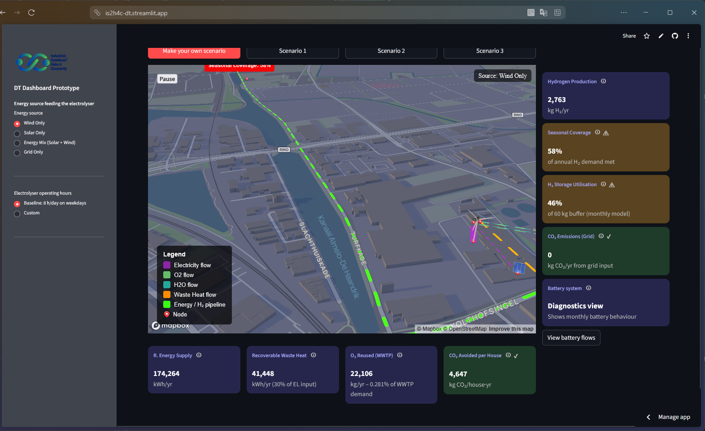

# Digital Twin – Hubs for Circularity 

#### Streamlit · MapboxGL · Python · Circular Economy · Hubs for Circularity · Industrial Symbiosis · Digital Twin


This repository contains an interactive **Digital Twin Dashboard** built with **Streamlit**, integrating **hydrogen production modelling**, **battery storage**, **seasonal demand simulation**, and a **Mapbox-based industrial symbiosis network visualisation**.


## Authors (to be fixed later)

**Hisham Afash**  
[](https://orcid.org/0009-0007-3127-7298)  
University of Twente – BMS Faculty  

**Iván Cárdenas León**  
[](https://orcid.org/0009-0005-0245-633X)  
University of Twente – ITC Faculty  

**Yifei Yu**  
[](https://orcid.org/0000-0001-5819-4651)  
University of Twente – BMS Faculty  

**Devrim Murat Yazan**  
[](https://orcid.org/0000-0002-4341-2529)  
University of Twente – BMS Faculty  

**Mila Koeva**  
[](https://orcid.org/0000-0001-7612-5270)  
University of Twente – ITC Faculty  


---

## Description
The digital twin is designed to support strategic scenario exploration for hydrogen hubs, including:

- Energy source switching (solar, wind, mixed, grid)
- Electrolyser operating hour schedules
- Battery-assisted renewable smoothing
- Hydrogen and oxygen flows
- Waste heat recovery
- Residential heat substitution
- Industrial symbiosis flows visualised on a 3D map

It is a fully functioning prototype used for teaching and research demonstrations within the EU IS2H4C project.

---
## Citation

> If you use this dataset, please cite:
~~~
@misc{AsfahIS2H4C,
author = {Asfah, Hisham and Cardenas-Leon, Ivan and AAA and BBB and Koeva, Mila},
title = {{Industrial Symbiosis and Hydrogen System Digital Twin}},
doi = {pending},
url = {is2h4c-dt.streamlit.app/}
}
~~~
---

## Features

### Hydrogen System Simulation

- Monthly renewable generation modelling based on capacity factors  
- Battery storage with charging/discharging efficiencies  
- Electrolyser utilisation model (weekday scheduling)  
- Monthly H₂ production, demand, and storage dynamics  

### Scenario Mode Selector

- **Scenario 1** – Baseline  
- **Scenario 2** – Overproduction risk (24h/day operation)  
- **Scenario 3** – Grid fallback  
- **Make your own scenario** – unrestricted controls  


### Industrial Symbiosis Visualisation (Mapbox + DeckGL)

- Real-time injection of model outputs into a geographic flow network  
- Flows include: **Hydrogen**, **Oxygen**, **Electricity**, **Waste Heat**, **Treated Water**  
- Node-level tooltips for houses, wastewater plant, electrolyser, solar/wind systems  

### KPI System with Traffic-Light Colours

- Hydrogen production  
- Seasonal coverage of H₂ demand  
- H₂ storage utilisation  
- CO₂ emissions from grid electricity  
- CO₂ avoided per house  
- Waste heat potential  
- Oxygen reuse at WWTP  

### Battery Diagnostics View

- Monthly breakdown of:
  - RES availability  
  - Electrolyser cap  
  - Battery charge/discharge  
  - Curtailment  
  - End-of-month SOC  
- Automatic chart generation with Altair  

---

## Project Structure

```text
DT-Dashboard/
│
├── dashboard/
│   ├── app.py                        # Main Streamlit application
│   └── data_constants.csv            # All model constants used by the simulator
│
├── map/
│   ├── map_test.html                 # Mapbox template with placeholders
│   ├── data/
│   │   ├── nodes.geojson             # Network nodes
│   │   ├── flows.csv                 # Raw directed edges and flow types
│   │   └── elec_to_houses.geojson    # Simple pipeline example for houses
│
├── docs/                             # Streamlit documentation
│   ├── calculations.md               # Hydrogen production calculations
├── requirements.txt                  # Required Python dependencies
└── README.md                         # This file
```

---

## Installation

### 1. Clone the repository

```bash
git clone https://github.com/<your-username>/<repo-name>.git
cd <repo-name>
```

### 2. Create and activate a virtual environment (optional but recommended)

```bash
python -m venv .venv
source .venv/bin/activate   # on macOS/Linux
# or
.venv\Scripts\activate    # on Windows
```

### 3. Install dependencies

```bash
pip install -r requirements.txt
```

### 4. Run the dashboard

```bash
streamlit run dashboard/app.py
```

### 5. Open in browser

If Streamlit does not open automatically, go to:

```text
http://localhost:8501
```

---

## Requirements

Minimal `requirements.txt`: 

```text
streamlit
pandas
numpy
geopandas
altair
pydeck
shapely
plotly
```

---

## Map Setup

The HTML template `map/map_test.html` contains placeholders that are dynamically replaced:

- `__NODES__`
- `__EDGES__`
- `__PIPELINE__`
- `__ENERGY_SOURCE__`
- `__WARNINGS__`

Update your Mapbox token in `app.py`:

```python
MAPBOX_KEY = "pk.XXXX"
STUDIO_STYLE = "mapbox://styles/<your-style-id>"
```

You can customise the **Mapbox Studio style** and node/edge rendering in the HTML template as needed.

---

## Key Performance Indicators (KPIs)

The dashboard automatically computes and displays:

| KPI | Description |
|-----|-------------|
| **Hydrogen production** | Annual H₂ production from renewable/grid energy |
| **Seasonal coverage** | % of annual H₂ demand met across the year |
| **H₂ storage utilisation** | Average buffer fill level and seasonal use profile |
| **CO₂ emissions (grid)** | Emissions attributable to grid-powered electrolysis |
| **CO₂ avoided per house** | Decarbonisation potential from substituting natural gas |
| **Recoverable waste heat** | Heat that can be reused on-site |
| **O₂ reused (WWTP)** | Oxygen supplied to WWTP for aeration |

The KPI cards include **colour-coded thresholds** and small status icons (✔, ⚠, ⛔) to communicate performance at a glance.

---
## Screenshots

### Main Dashboard


### Network Map Animation
[▶️ View flows animation](Images/FlowsAnimation.mp4)

### Battery Diagnostics Dialog


---

## Academic / Teaching Context

If you use this tool in a course or publication, please consider citing the repository.

---

## License

This work is licensed under a
[Creative Commons Attribution-NonCommercial-ShareAlike 4.0 International License][cc-by-nc-sa].

[![CC BY-NC-SA 4.0][cc-by-nc-sa-image]][cc-by-nc-sa]

[cc-by-nc-sa]: http://creativecommons.org/licenses/by-nc-sa/4.0/
[cc-by-nc-sa-image]: https://licensebuttons.net/l/by-nc-sa/4.0/88x31.png
[cc-by-nc-sa-shield]: https://img.shields.io/badge/License-CC%20BY--NC--SA%204.0-lightgrey.svg

---

## Acknowledgements

Developed as part of the **IS2H4C – Industrial Symbiosis Hubs for Cilarity** initiative (EU Horizon Europe).  


---
